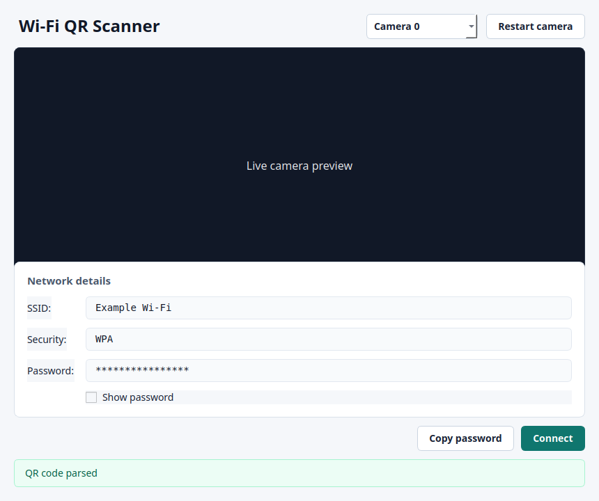

# WWC — Wi-Fi With Camera

WWC is a free and open source desktop app for scanning Wi-Fi QR codes with your
webcam.

I built this because I personally wanted a simple desktop tool that works like a
phone: show a Wi-Fi QR code to the camera, read the network details, and connect
without typing a long password by hand.

WWC currently supports Linux and Windows. macOS support is planned for the
future, but it is not available yet.

## Screenshots

### Main Window



## Features

- Scan Wi-Fi QR codes with a live camera preview
- Decode QR codes using ZXing
- Show SSID, security type, and password
- Handle escaped characters in Wi-Fi QR codes
- Copy the detected password
- Connect on Linux through NetworkManager's `nmcli`
- Connect on Windows through `netsh wlan`
- Work locally without an account, cloud service, or telemetry

## Supported Platforms

| Platform | Status | Notes |
| --- | --- | --- |
| Linux | Supported | Uses `nmcli`, so NetworkManager is required for automatic connection. |
| Windows | Supported | Uses `netsh wlan` for automatic connection. |
| macOS | Planned | Not supported in this release. |

## Download

Download the latest build from the project's GitHub Releases page:

https://github.com/adhikaribibek231/wifi-with-camera/releases

For v0.1.0:

- Linux users should download `WWC-linux.AppImage`.
- Windows users should download `WWC-windows.zip`.

## Install on Linux

1. Download `WWC-linux.AppImage` from the release page.
2. Open a terminal in the folder where you downloaded it.
3. Make it executable:

   ```bash
   chmod +x WWC-linux.AppImage
   ```

4. Run it:

   ```bash
   ./WWC-linux.AppImage
   ```

5. If your desktop asks for camera permission, allow it.

The AppImage is portable and does not require system-wide installation.

Some Linux distributions may require camera permissions or proper `/dev/video*`
access.

For automatic Wi-Fi connection on Linux, `nmcli` must be installed and your
system must use NetworkManager. If automatic connection fails, WWC can still
show the Wi-Fi details so you can copy the password manually.

## Install on Windows

WWC is currently distributed as a portable application on Windows.

1. Download `WWC-windows.zip` from the release page.
2. Extract the ZIP file.
3. Open the extracted folder.
4. Run `WWC.exe`.
5. If Windows shows a security warning, only continue if the file came from the
   official WWC release page.

Do not run `WWC.exe` from inside the ZIP file. Extract it first.

## How to Use WWC

1. Open WWC.
2. Choose the camera you want to use, if more than one camera is available.
3. Hold a Wi-Fi QR code in front of the camera.
4. Wait for WWC to detect and parse the QR code.
5. Review the detected network name, security type, and password.
6. Use `Show password` if you need to view the password.
7. Use `Copy password` if you want to paste it somewhere else.
8. Click `Connect` if you want WWC to try connecting automatically.

WWC supports standard Wi-Fi QR codes like:

```text
WIFI:T:WPA;S:MyNetwork;P:MyPassword;;
```

Open networks are also supported when the QR code uses `nopass`.

WWC currently focuses on standard Wi-Fi QR formats commonly generated by routers
and phones.

## Privacy

WWC is designed to work locally.

- QR scanning happens on your computer.
- Wi-Fi credentials are parsed on your computer.
- WWC does not require an account.
- WWC does not send your Wi-Fi password to a server.
- WWC does not include telemetry.

Wi-Fi QR codes can contain plain-text passwords, so only scan QR codes you trust.

## Release Notes

### WWC v0.1.0

Initial public release of WWC — Wi-Fi With Camera.

WWC v0.1.0 is an early public release. Some desktop environments, camera setups,
or network configurations may behave differently across systems.

Included in this release:

- Wi-Fi QR scanning
- ZXing-based QR decoding
- Linux and Windows support
- PySide6 desktop GUI
- Live camera preview
- QR parsing with escaped character handling
- Linux `nmcli` integration
- Windows `netsh wlan` integration

Linux:

Download `WWC-linux.AppImage`, make it executable, and run it.

Windows:

Download and extract `WWC-windows.zip`, then run `WWC.exe`.

## Run from Source

For development, WWC uses Python 3.12 and `uv`.

Clone the repository:

```bash
git clone https://github.com/adhikaribibek231/wifi-with-camera.git
cd wifi-with-camera
```

Install dependencies:

```bash
uv sync
```

Run the desktop app:

```bash
uv run wwc-gui
```

Run the CLI flow:

```bash
uv run wwc
```

Run tests:

```bash
uv run pytest
```

Run linting and type checks:

```bash
uv run ruff check .
uv run mypy
```

## Project Goals

WWC aims to stay:

- simple to use
- offline-first
- privacy-friendly
- free and open source
- focused on Wi-Fi QR scanning and desktop connection

## Future Plans

- macOS support
- Improved installers
- More connection status details
- Better camera compatibility
- More user-facing documentation

## Contributing

Contributions are welcome. You can help by opening issues, testing releases on
different Linux and Windows systems, improving documentation, or submitting pull
requests.

Useful commands before opening a pull request:

```bash
uv run ruff check .
uv run mypy
uv run pytest
```

## License

WWC is free and open source software licensed under the MIT License. See
[`LICENSE`](LICENSE) for the full license text.

## Author

Built by Bibek Adhikari.
